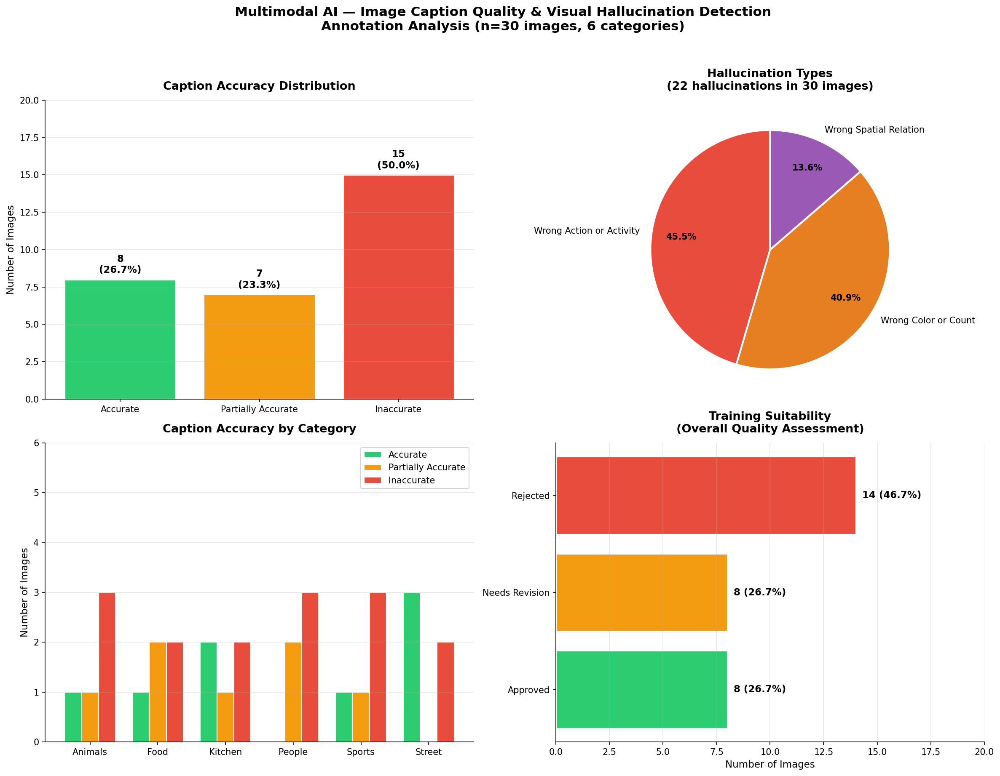

# Multimodal AI — Image Caption Quality & Visual Hallucination Detection

An end-to-end multimodal annotation project evaluating AI-generated image 
captions across six visual categories — mirroring real-world vision-language 
model (VLM) quality evaluation pipelines used at companies like Google, Meta, 
and Apple.

---

## Project Overview

Vision-Language Models (VLMs) like GPT-4V, Gemini Vision, and Claude Vision 
are increasingly deployed in high-stakes applications. However, they frequently 
produce visual hallucinations — confidently describing objects, actions, or 
scenes that do not exist in the image. This project simulates the annotation 
pipeline used by multimodal AI teams to detect and categorize these visual 
hallucinations before model training or deployment.

**Primary goal:** Design and execute a multi-dimensional image caption 
evaluation pipeline to identify visual hallucination patterns across six 
image categories.

---

## Annotation Schema

A custom 4-dimension ontology was designed and built in Labelbox:

| Dimension | Description | Labels |
|---|---|---|
| Caption Accuracy | Does the caption correctly describe the image? | Accurate, Partially Accurate, Inaccurate |
| Visual Hallucination Type | What category of visual error occurred? | None, Wrong Color or Count, Wrong Spatial Relation, Wrong Action or Activity |
| Detail Level | Does the caption capture sufficient visual detail? | Sufficient, Insufficient, Excessive |
| Overall Quality | Is this caption suitable for VLM training data? | Approved, Needs Revision, Rejected |

---

## Dataset

- **Total images annotated:** 30 images across 6 categories
- **Image categories:** Animals, Food, Sports, Street, Kitchen, People
- **Image source:** Unsplash (via API — free commercial license)
- **Captions:** AI-generated captions evaluated against ground truth
- **Annotation platform:** Labelbox
- **Annotator:** Tejasai Kola
- **Annotation date:** May 2026
- **Average annotation time:** 77.0 seconds per image

---

## Key Findings

| Metric | Result |
|---|---|
| Accurate captions | 8 / 30 (26.7%) |
| Partially accurate captions | 7 / 30 (23.3%) |
| Inaccurate captions | 15 / 30 (50.0%) |
| Captions with hallucinations | 22 / 30 (73.3%) |
| Approved for VLM training | 8 / 30 (26.7%) |
| Rejected for VLM training | 14 / 30 (46.7%) |
| Avg annotation time | 77.0 seconds per image |

### Hallucination type breakdown

| Hallucination Type | Count | Percentage |
|---|---|---|
| Wrong Action or Activity | 10 | 45.5% |
| Wrong Color or Count | 9 | 40.9% |
| Wrong Spatial Relation | 3 | 13.6% |

### Accuracy by category

| Category | Accurate | Partially Accurate | Inaccurate | Hallucination Rate |
|---|---|---|---|---|
| Animals | 1 | 1 | 3 | 80% |
| Food | 1 | 2 | 2 | 80% |
| Kitchen | 2 | 1 | 2 | 60% |
| People | 0 | 2 | 3 | 100% |
| Sports | 1 | 1 | 3 | 80% |
| Street | 3 | 0 | 2 | 40% |

### Key insight — category performance

The People category had a **100% hallucination rate** — every AI caption 
contained at least one visual error. Street scenes had the lowest hallucination 
rate at 40%, suggesting vision models perform better on structured outdoor 
environments than on human-centric scenes.

**Wrong Action or Activity** was the dominant error type at 45.5%, indicating 
that current vision models struggle most with understanding dynamic activities 
and behaviors — not just object identification.

---

## Analysis Charts

**Chart 1 — Caption Accuracy Distribution:** 50% of captions were factually 
inaccurate — significantly higher than the 14% hallucination rate found in 
text-only LLM evaluation, confirming that visual understanding remains a 
harder problem for AI than text generation.

**Chart 2 — Hallucination Types:** Wrong Action or Activity dominated at 
45.5%, followed by Wrong Color or Count at 40.9%. This suggests vision models 
have stronger object detection than activity recognition capabilities.

**Chart 3 — Accuracy by Category:** People category showed the worst 
performance with 0 accurate captions, while Street achieved the best accuracy 
at 60%. This pattern aligns with published research showing VLMs struggle with 
human pose estimation and social context understanding.

**Chart 4 — Training Suitability:** Only 26.7% of captions were approved for 
VLM training data. 73.3% would require revision or rejection — demonstrating 
the critical importance of human annotation in multimodal AI pipelines.

---

## Comparison with Text LLM Evaluation

This project was conducted as a follow-up to a text-based LLM hallucination 
detection project. Key differences:

| Metric | Text LLM Project | Vision LLM Project |
|---|---|---|
| Total items annotated | 50 responses | 30 images |
| Hallucination rate | 14.0% | 73.3% |
| Most common error | Fabricated Fact | Wrong Action or Activity |
| Training approval rate | 86.0% | 26.7% |
| Avg annotation time | 27.5 seconds | 77.0 seconds |

Vision models show a **5x higher hallucination rate** than text models, and 
image annotation requires **2.8x more time** per item than text annotation — 
consistent with industry benchmarks for multimodal data labeling.

## Tools & Technologies

| Tool | Purpose |
|---|---|
| Labelbox | Annotation platform — ontology design, image labeling, export |
| Labelbox Python SDK | Programmatic data upload and dataset management |
| Unsplash API | Image sourcing — free commercial license |
| Google Drive API | Image hosting for Labelbox URL access |
| Python | Data parsing, analysis, visualization |
| Pandas | DataFrame manipulation and CSV export |
| Matplotlib | Chart generation |
| JSON / NDJSON | Annotation import and export formats |

---
